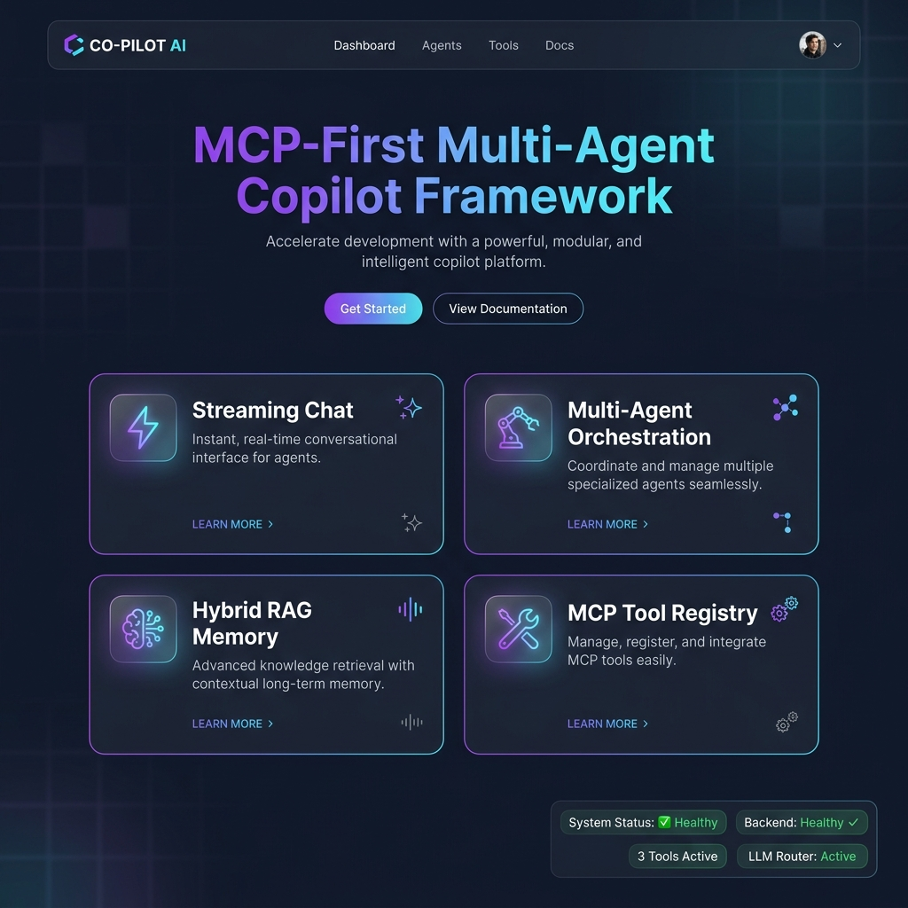
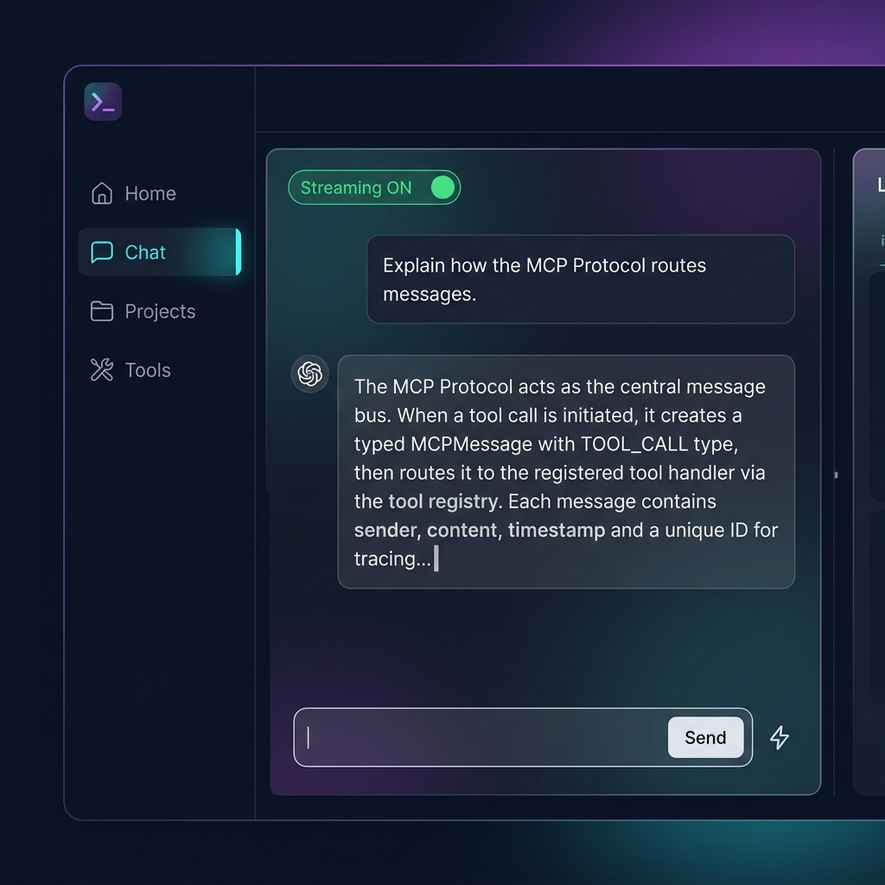
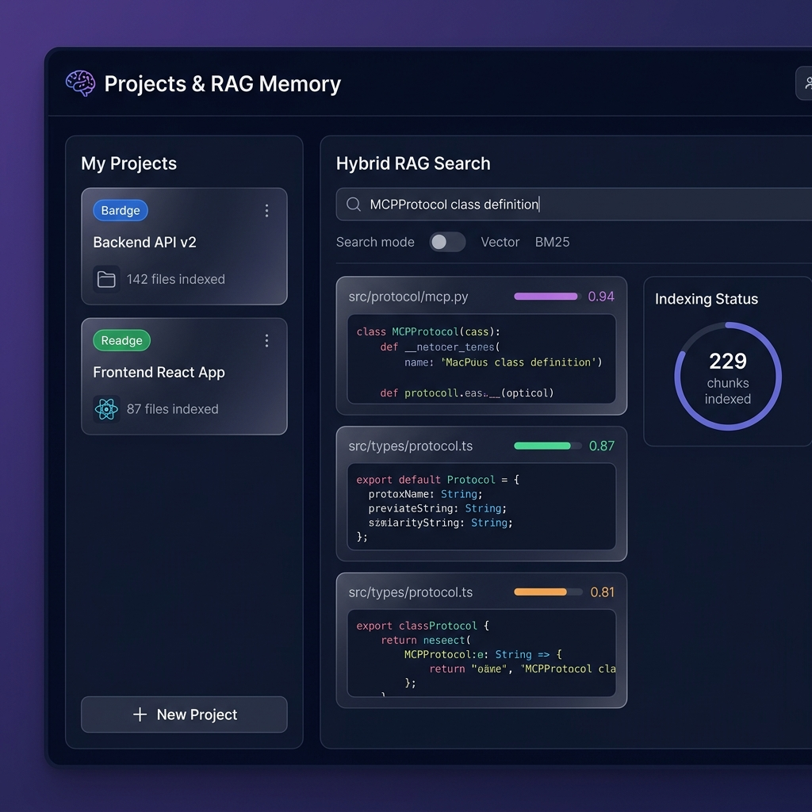
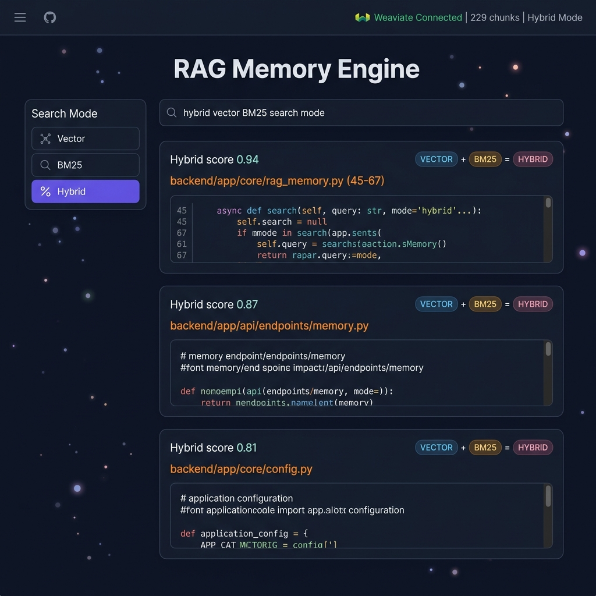
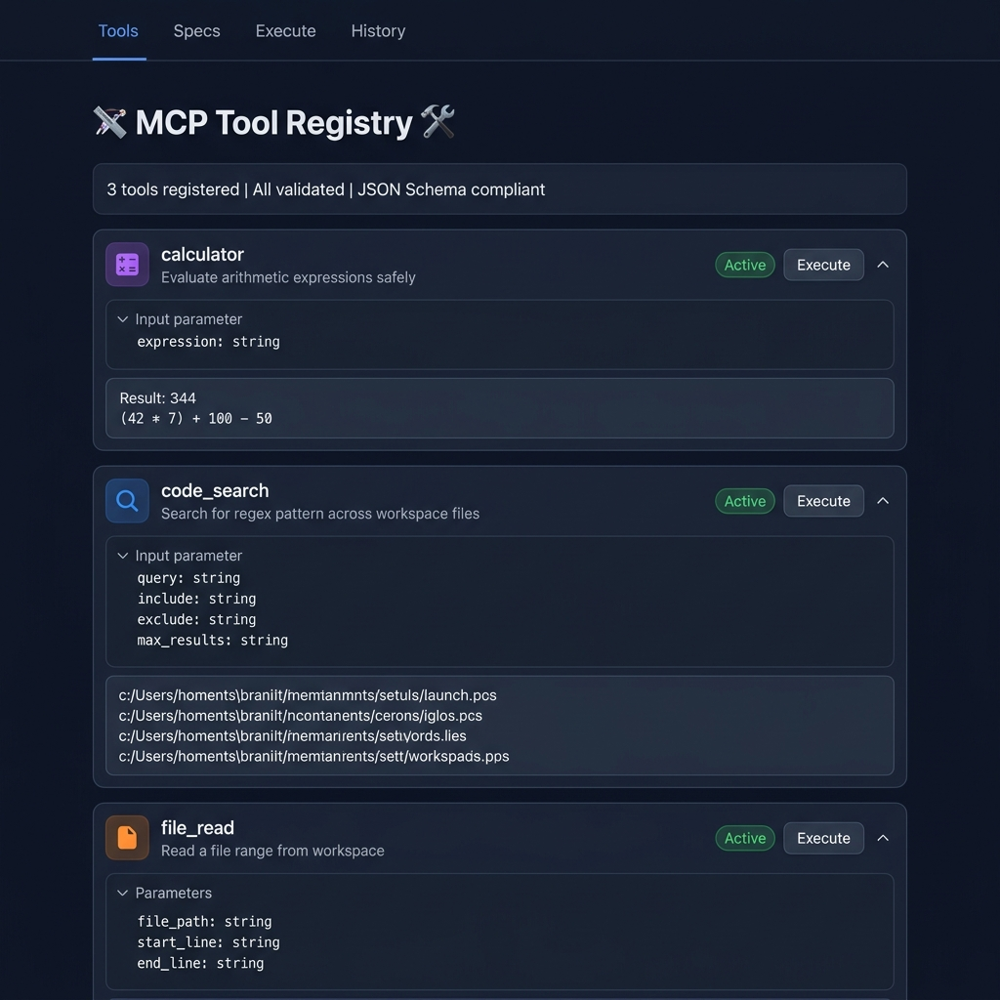
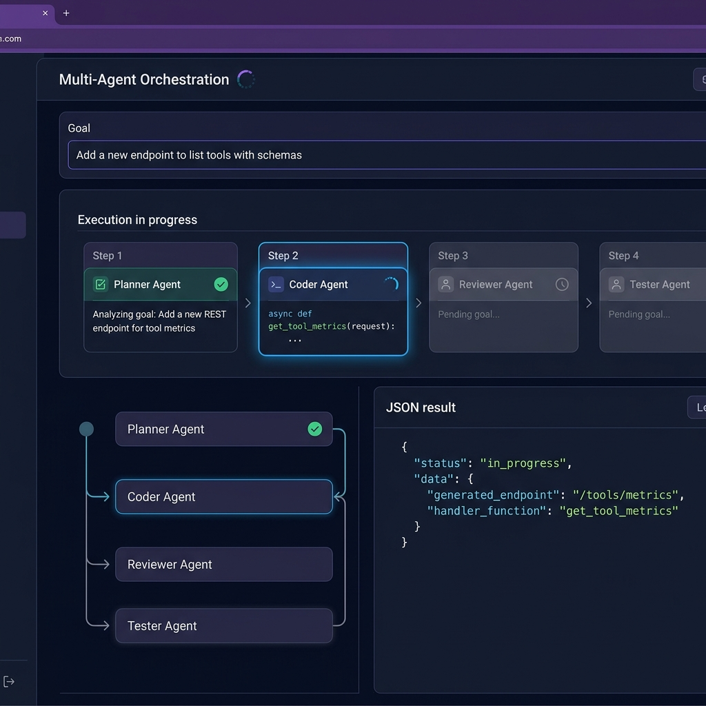
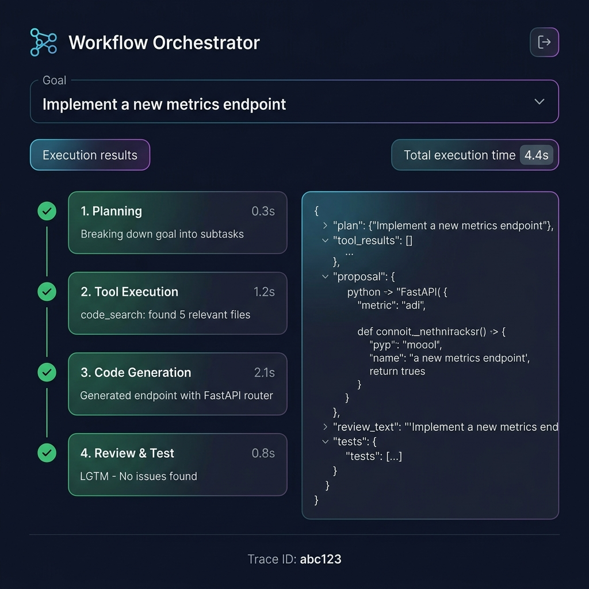
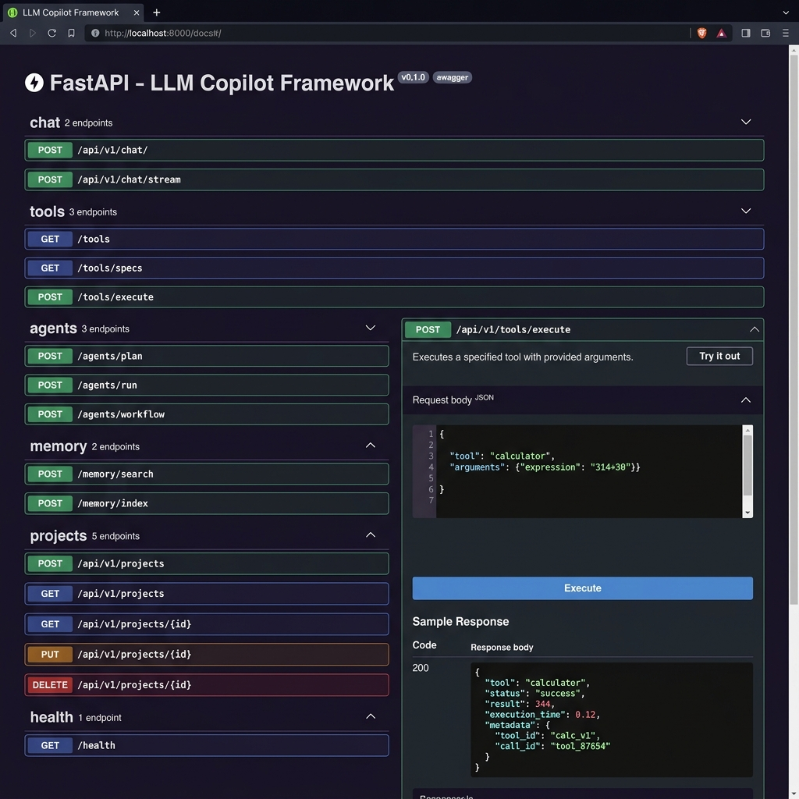

# LLM Copilot Framework

Open-source, production-oriented framework for developer copilots with MCP orchestration, hybrid RAG, streaming chat, and multi-agent workflows.

[](https://www.python.org/)
[](https://fastapi.tiangolo.com/)
[](https://react.dev/)
[](LICENSE)

## Overview



This project builds an industry-grade copilot platform that combines:
- **MCP protocol** for tool routing and agent messaging
- **Hybrid RAG** (vector + BM25) for robust retrieval
- **Streaming chat** via SSE
- **Multi-agent workflows** (planner → coder → reviewer → tester)
- **Pluggable tools** with JSON-schema validation
- **Workflow orchestration** with traceable execution steps
- **Plugin system** for extensions and external tools
- **Evaluation harness** for RAG regression checks

## Architecture

```
┌──────────────────────────────────────────────────────────────────────────────┐
│                                Client Surfaces                               │
│  Web UI (React) • API Clients • (Optional) VS Code Extension • CLI            │
└──────────────────────────────────────────────────────────────────────────────┘
                                         ↕
┌──────────────────────────────────────────────────────────────────────────────┐
│                           API Gateway / FastAPI Layer                         │
│  Auth • CORS • Rate Limits • Request Validation • SSE Streaming               │
└──────────────────────────────────────────────────────────────────────────────┘
                                         ↕
┌──────────────────────────────────────────────────────────────────────────────┐
│                              MCP Protocol Layer                               │
│   Message Routing • Tool Registry • JSON Schema Validation • Tracing          │
└──────────────────────────────────────────────────────────────────────────────┘
                                         ↕
┌──────────────┬────────────────┬────────────────┬─────────────────────────────┐
│  LLM Router  │  RAG Memory    │  Tool Agents   │  Workflow Orchestrator       │
│ Multi-LLM    │ Hybrid Search  │ MCP Executors  │ Planner → Coder → Reviewer   │
└──────────────┴────────────────┴────────────────┴─────────────────────────────┘
                                         ↕
┌───────────────────────┬───────────────────────┬──────────────────────────────┐
│ Vector DB (Weaviate)  │ Embeddings Provider   │ Plugin Manager + Manifests    │
│ Hybrid (BM25+Vector)  │ Groq/OpenAI/Hash      │ Sandboxed tools & extensions  │
└───────────────────────┴───────────────────────┴──────────────────────────────┘
                                         ↕
┌──────────────────────────────────────────────────────────────────────────────┐
│                       Observability & Reliability Layer                       │
│  Structured Logs • Metrics • Traces • Eval Harness • Fallbacks                │
└──────────────────────────────────────────────────────────────────────────────┘
```

## Workflow Architecture


## Platform Features & Screenshots

### Home Dashboard


### Chat Interface (Streaming UI)


### Projects & RAG Engine


### Hybrid RAG Search


### MCP Tool Registry


### Multi-Agent Orchestration


### Workflow Orchestration


### API Documentation (Swagger)


## Implemented Features

### MCP and Tools
- Tool registry with JSON‑schema validation
- `/api/v1/tools/specs` for tool discovery
- Advanced tools:
  - `code_search` (regex search across workspace)
  - `file_read` (safe file range reads)
  - `calculator` (simple sanity tool)

### Workflow Orchestration
- Industry workflow endpoint: `/api/v1/agents/workflow`
- Traceable steps across planning, tools, review, and testing

### Multi-Agent Orchestration
- Planner → Coder → Reviewer → Tester workflow
- Endpoint: `/api/v1/agents/run`
- Planner with tool orchestration: `/api/v1/agents/plan`

### RAG Memory Engine
- Weaviate v4 client
- Hybrid retrieval (vector + BM25)
- Automatic fallback to BM25 when embeddings fail

### Streaming Chat
- SSE endpoint: `/api/v1/chat/stream`
- UI toggle in Chat page

### LLM Routing
- Groq + OpenAI providers
- Default provider switchable via config

### Plugins and Evaluation
- Plugin manager with manifest loading
- Evaluation endpoint: `/api/v1/eval/rag`

## Tech Stack

**Backend**
- FastAPI, Pydantic, Weaviate
- Groq + OpenAI (LLM + embeddings)
- Redis (optional)

**Frontend**
- React + TypeScript + Vite
- TanStack Query + Tailwind

## Quick Start

### Backend (WSL)
```bash
cd /mnt/d/proj1/backend
poetry install
nohup poetry run uvicorn app.main:app --host 0.0.0.0 --port 8001 --reload > /tmp/backend.log 2>&1 &
```

### Frontend (Windows)
```powershell
cd D:\proj1\frontend
npm install
npm run dev
```

Open the URL Vite prints (e.g., http://localhost:3002).

If the backend runs on port 8001, set:

```
VITE_API_URL=http://localhost:8001
```

## Environment

Set keys in [backend/.env](backend/.env):

```
GROQ_API_KEY=your_key
OPENAI_API_KEY=optional
EMBEDDING_PROVIDER=groq
```

## Test the Advanced Features

### Tool Planner (MCP)
```
POST /api/v1/agents/plan
{"goal":"Find where MCPProtocol is defined and show the first 10 lines"}
```

### Multi-Agent Run
```
POST /api/v1/agents/run
{"goal":"Add a new endpoint to list tools with schemas"}
```

### Streaming Chat (SSE)
```
POST /api/v1/chat/stream
{"messages":[{"role":"user","content":"Say hello in one sentence."}]}
```

### Hybrid RAG Search
```
POST /api/v1/memory/search
{"query":"MCPProtocol","top_k":3,"mode":"hybrid"}
```

## Roadmap (Next)
- MCP streaming tool traces in UI
- VS Code extension integration
- Role-based access control for tools and plugins
- Job queue for large-scale indexing
- Observability dashboards and alerts

## Production Hardening Checklist (Recommended)
- Authentication and authorization with scoped tool permissions
- Rate limiting and request quotas
- Structured logging, metrics, and distributed tracing
- Background job queue for indexing and long-running tasks
- Persistent project metadata store
- Secrets management and environment isolation

## Contributing

See [CONTRIBUTING.md](CONTRIBUTING.md).

## License

MIT — see [LICENSE](LICENSE).
